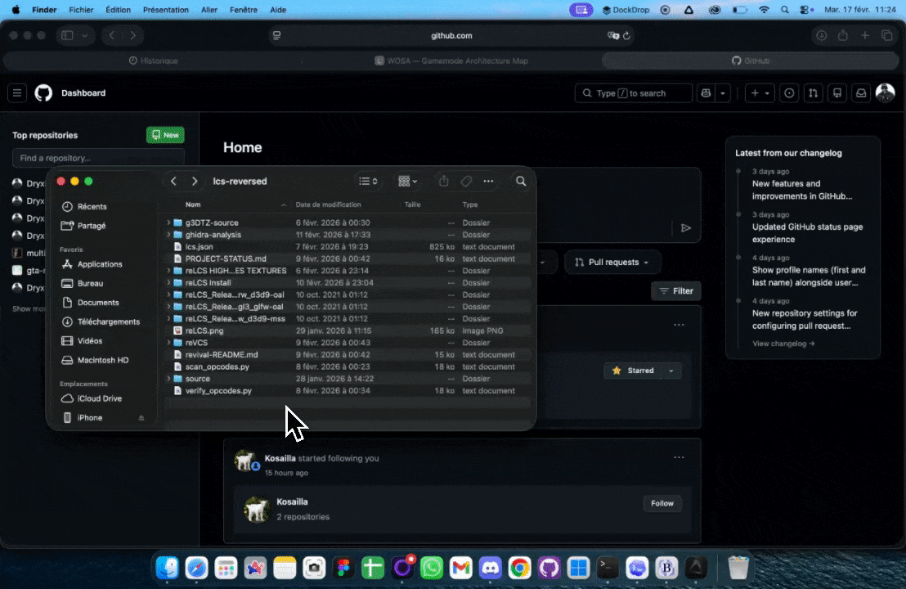

# DockDrop

DockDrop is a macOS menu bar app that shows a floating app shelf while you drag files, then activates target apps when you hover their icon.
Built this because native macOS drag/drop files is not intuitive nor confortable. I wish we could get it of the shelf and make it work directly with the docker, but technically not possible at the moment.


## Build

```bash
swift build
swift run DockDrop
```
